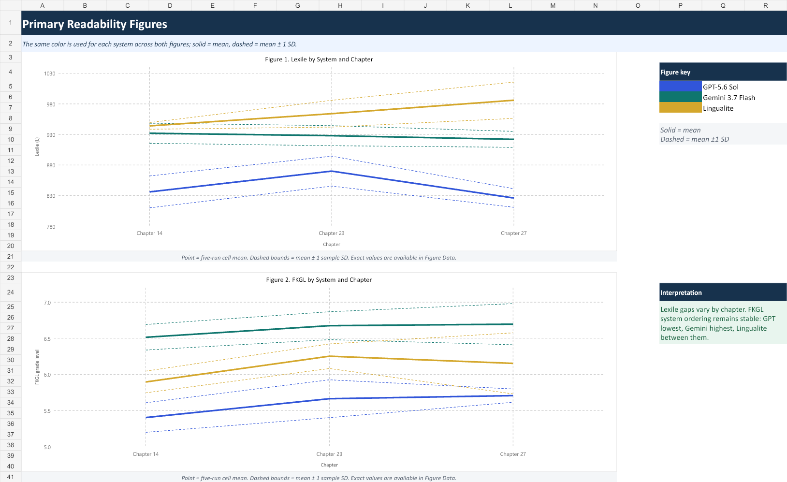
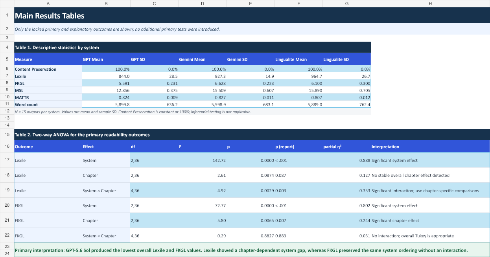

# AI Educational Text Evaluation

This is the primary research project in the portfolio. It evaluates AI-generated English adaptations of selected *Journey to the West* chapters for possible educational use.

## Research design

- 3 source chapters;
- 3 generation systems/conditions;
- 5 repeated runs per chapter and system;
- 45 generated outputs in the private study dataset.

The systems represented in the aggregate figures are GPT-5.6 Sol, Gemini 3.7 Flash, and a Lingualite/multi-agent condition. Some private working filenames used `Multi-Agent`; the public documentation uses the study labels shown in the final aggregate workbook.

## What was evaluated

- readability: Flesch–Kincaid Grade Level and Dale–Chall;
- length and sentence structure;
- lexical diversity, including MATTR;
- externally supplied official Lexile results;
- evidence-based content preservation;
- exact and near-duplicate output checks;
- system and chapter differences, post-hoc comparisons, and run sensitivity.

The project evaluates generated **materials**, not learners. There was no learner experiment, so the results do not establish learning outcomes.

## Public repository contents

- `analysis.py`: the project-specific metric, Lexile-import, content-preservation, and stability logic in one module;
- `statistics.py`: ANOVA, Tukey post-hoc comparisons, assumption checks, and run sensitivity;
- `METHOD_NOTES.md`: plain-language explanation of the research logic;
- `tests/`: in-memory tests; no saved sample dataset;
- `figures/`: selected aggregate outputs only.

## Private data policy

The 45 generated texts, source chapters, external Lexile files, content-coding tables, spreadsheets, and derived CSV files are not published.

Expected analytical fields include:

```text
output_id, system, chapter, run,
fkgl, lexile, mattr, dale_chall,
mean_sentence_length, word_count, content_score
```

Expected evidence-coding fields are documented in `analysis.py`. A preserved content point requires an exact excerpt and a complete codebook coverage check. The study's content-preservation coding was LLM-assisted and is not human gold-standard annotation.

## Run tests

```bash
python -m unittest discover -s tests -v
```

Install dependencies first:

```bash
python -m pip install -r requirements.txt
```

## AI-assisted development

The current codebase is a later AI-assisted reproducibility refactor of the analytical workflow used in the study, developed with substantial assistance from OpenAI Codex for organization, implementation, testing, and debugging. I defined the research questions, analytical requirements, data structure, interpretation, and validation logic.

## Selected aggregate figures




