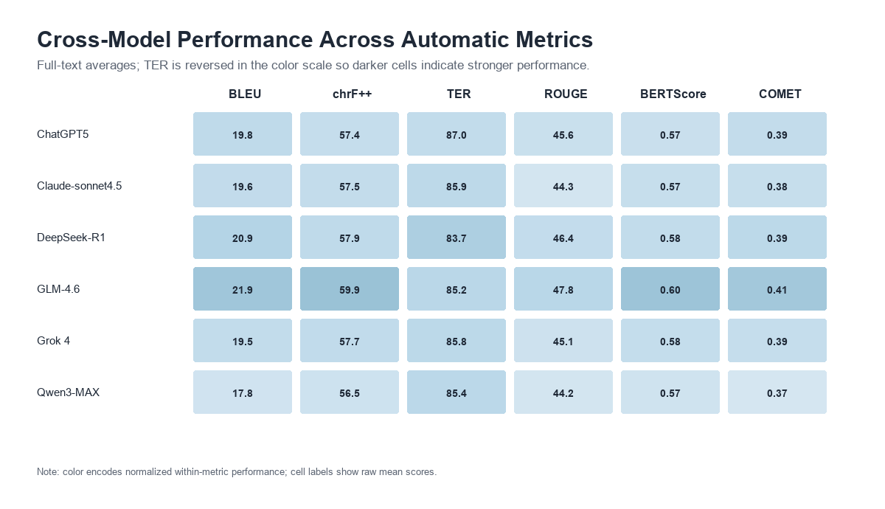
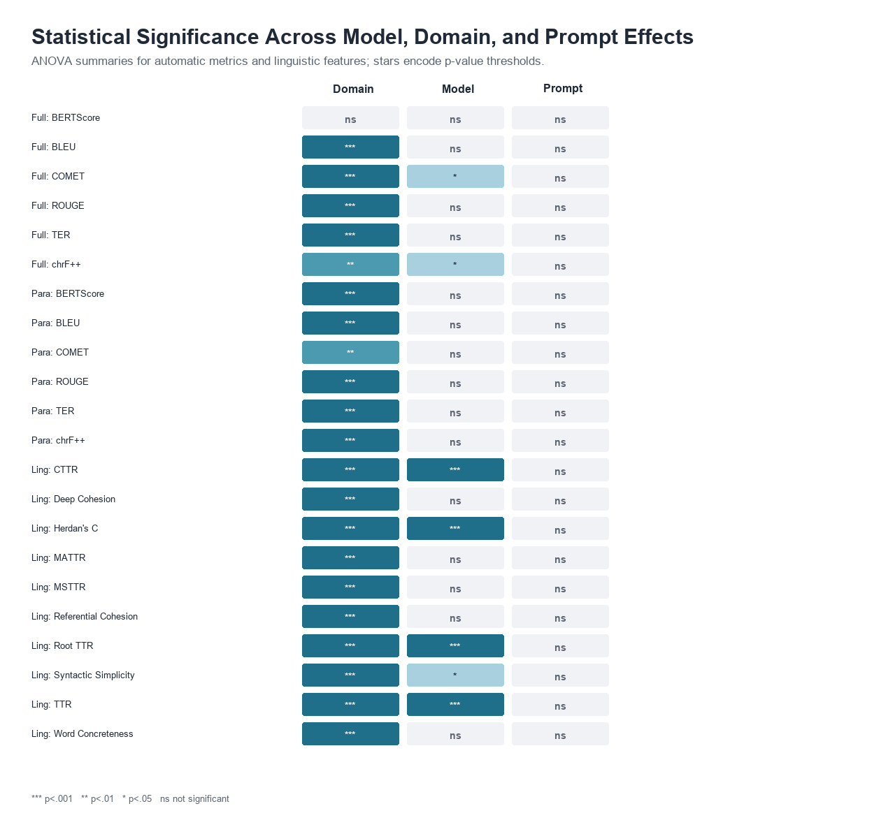
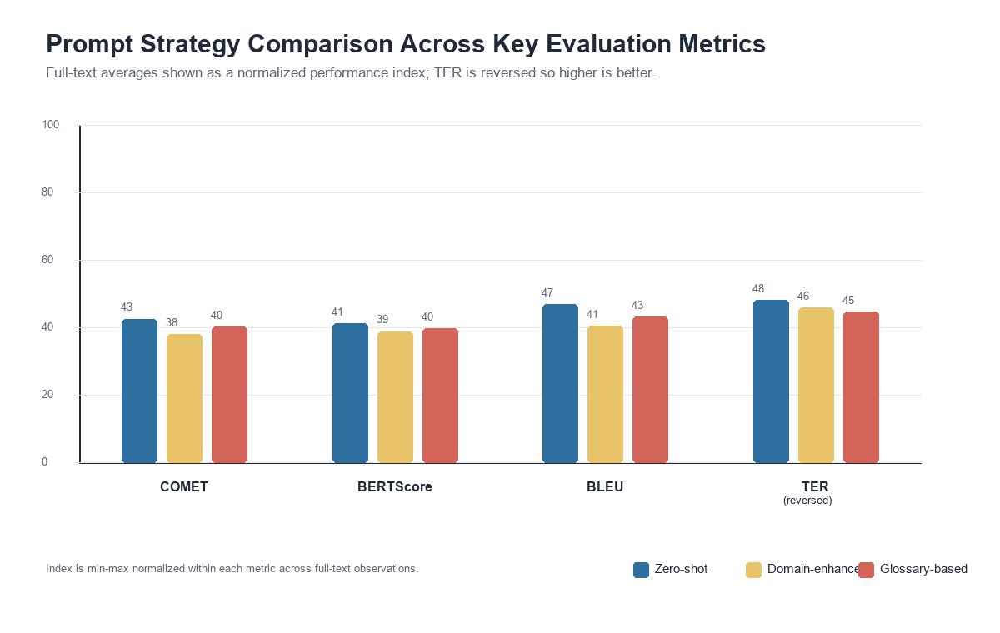
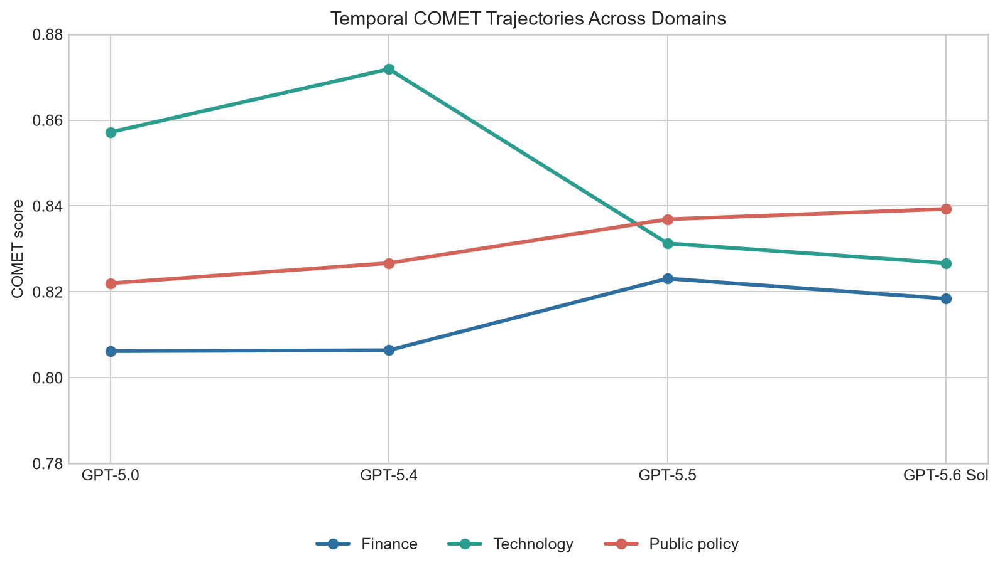
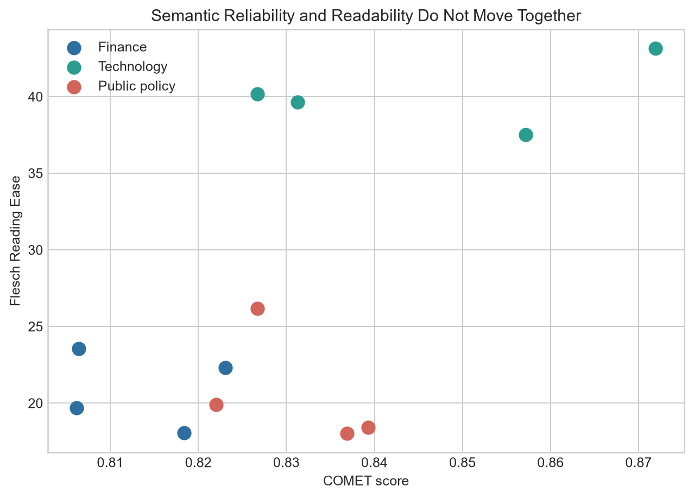
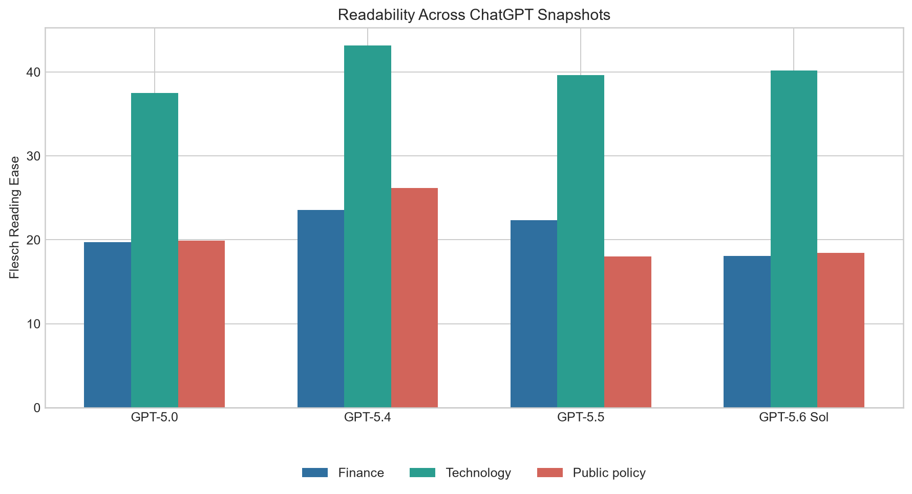

# Bilingual LLM Evaluation

This project contains two related Chinese–English LLM evaluation studies.

## Cross-model study

The primary study compares six models across three domains and three prompt strategies. The private research records include 54 full-text model/domain/prompt conditions and 432 scored segments in the consolidated paragraph-level table.

The evaluated dimensions include COMET, BLEU, chrF++, TER, ROUGE, BERTScore, readability, lexical characteristics, and selected cohesion features. Model, domain, and prompt are the main statistical factors.

## Temporal-reliability case study

A smaller study compares four ChatGPT snapshots across finance, policy, and technology texts. It is descriptive: one text per domain/snapshot does not support a population-level claim about model superiority or improvement over time.

## Public repository contents

- `analysis.py`: validation, transparent text measures, optional official COMET scoring, aligned-segment aggregation, and temporal summaries;
- `statistics.py`: the cross-model model/domain/prompt analysis, Tukey post-hoc comparisons, and a clearly marked supplementary paired utility;
- `METHOD_NOTES.md`: plain-language explanation;
- `tests/`: in-memory dummy values only;
- `figures/`: selected aggregate study figures.

Metric logic is grouped inside this paper project. There is no standalone metric-by-metric toolkit repository.

## Input schema

Research data are private and not included. The cross-model analysis expects fields such as:

```text
text_id, domain, model, prompt,
source_zh, reference_en, output_en,
BLEU, chrF, TER, ROUGE, BERTScore, COMET
```

Aligned COMET segments additionally require:

```text
segment_id, source_segment, reference_segment, output_segment
```

## COMET and long texts

The code uses an official COMET checkpoint. It does not split long source/output/reference texts independently, because that could create invalid alignment. It scores manually aligned segments when they are available and calculates the document score as the **arithmetic mean of accepted aligned segment scores**. An over-limit unaligned text is flagged for review rather than silently scored.

## Statistical-design boundary

The cross-model paper analysis examines model, domain, and prompt effects. The paired function in `statistics.py` is a supplementary utility for a different two-condition design; it is not the primary statistical design reported for the six-model study.

## Private data policy

No CSV/XLSX/TMX data, source/reference text, model output, questionnaire, or participant data are published. The 106 recovered TMX files remain private evidence of sentence-, paragraph-, and document-level bilingual alignment.

## Run tests

```bash
python -m pip install -r requirements.txt
python -m unittest discover -s tests -v
```

COMET is optional because its model environment is large:

```bash
python -m pip install -r requirements-comet.txt
```

## AI-assisted development

I designed the research comparisons, data organization, evaluation requirements, and interpretation workflow. OpenAI Codex substantially assisted code generation, refactoring, debugging, tests, and documentation. The evaluated LLMs generated research outputs; they were not developed by me.

## Selected aggregate figures












