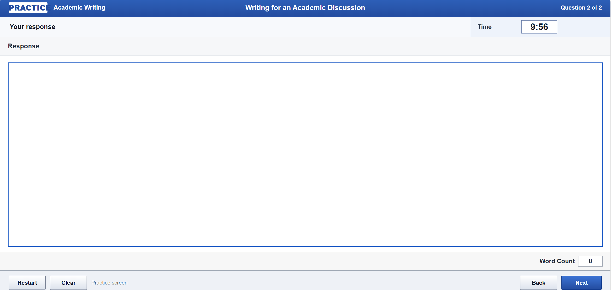

# Timed Academic Writing

A small offline Python/Tkinter prototype for focused academic writing practice.

## What it does

- displays a generic academic discussion prompt;
- starts a ten-minute countdown;
- provides an editable response area;
- updates a live English word count;
- warns when two minutes remain;
- locks the response when time expires;
- supports restart, clear, copy, and local UTF-8 draft saving.

The app is intentionally limited. It is not an official ETS product, a TOEFL simulation, an automated scoring system, or an AI feedback service. It does not send the learner's writing to an external service.

## Run

The application uses only Python's standard library.

```bash
python timed_academic_writing.py
```

## Test

The non-GUI word-count and timer helpers are tested without saving fixture files:

```bash
python -m unittest discover -s tests -v
```

## Privacy

Writing stays in the local application unless the learner chooses to copy or save it. Saved drafts are plain-text files at a user-selected location.


## AI-assisted development

I defined the practice scenario, timer behavior, learner controls, and scope. OpenAI Codex substantially assisted implementation, debugging, and documentation. 
